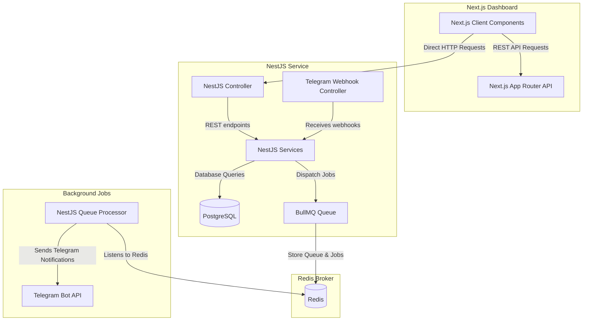

# 🚀 Architecture & Skeleton: Next.js + NestJS + PostgreSQL + Redis + BullMQ + Telegram Bot

This workspace contains the complete folder structure and skeleton for a modern, decoupled web application.



---

## 📁 Folder Structure

```text
boot/
├── docker-compose.yml       # Infrastructure (PostgreSQL, Redis, Adminer)
├── README.md                # This documentation
├── dashboard/               # Next.js Dashboard (Frontend)
│   ├── package.json
│   ├── tsconfig.json
│   ├── next.config.js
│   ├── .env.example
│   └── src/
│       ├── lib/
│       │   └── api.ts       # API Client for backend communications
│       └── app/
│           ├── globals.css  # CSS custom properties and sleek variables
│           ├── layout.tsx   # Base html layout (fonts, metadata)
│           ├── page.tsx     # Login/Landing entry point
│           └── dashboard/
│               ├── layout.tsx # Persistent sidebar/header layout
│               └── page.tsx   # Dashboard statistics & activity overview
│
└── backend/                 # NestJS Webhook & API Service (Backend)
    ├── package.json
    ├── tsconfig.json
    ├── .env.example
    ├── prisma/
    │   └── schema.prisma    # Database structure (User, TelegramUser, Jobs)
    └── src/
        ├── main.ts          # NestJS entrypoint (Bootstrapper)
        ├── app.module.ts    # Main app registry (Config, Redis, Database, Queues)
        ├── prisma/
        │   └── prisma.service.ts # DB client service wrapper
        ├── telegram/
        │   ├── telegram.module.ts
        │   ├── telegram.controller.ts # Webhook receiver controller
        │   └── telegram.service.ts    # Logic for Bot Telegram API
        └── jobs/
            ├── jobs.module.ts
            └── telegram.processor.ts  # BullMQ background runner for telegram tasks
```

---

## 🛠️ Tech Stack & Setup Instructions

### 1. Prerequisites
Ensure you have the following installed on your system:
- **Node.js** (v18+)
- **Docker & Docker Compose**
- **npm** (or yarn/pnpm)

### ⚡ Quick Start (Monorepo Single-Command)

In the root folder (`boot/`), you can execute everything with these shortcuts:

```bash
# 1. Start Docker Containers (PostgreSQL & Redis)
npm run docker:up

# 2. Install all dependencies across backend & dashboard
npm run install:all

# 3. Push Prisma Database Schema to PostgreSQL
npm run db:push

# 4. Start both Backend & Dashboard concurrently
npm run dev
```

- **Dashboard**: `http://localhost:3000`
- **NestJS REST API**: `http://localhost:3001`
- **Adminer DB Client**: `http://localhost:8080`

